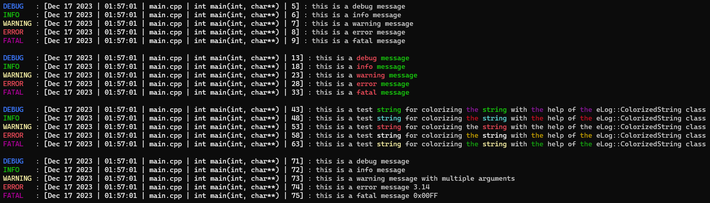
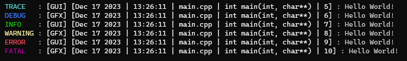
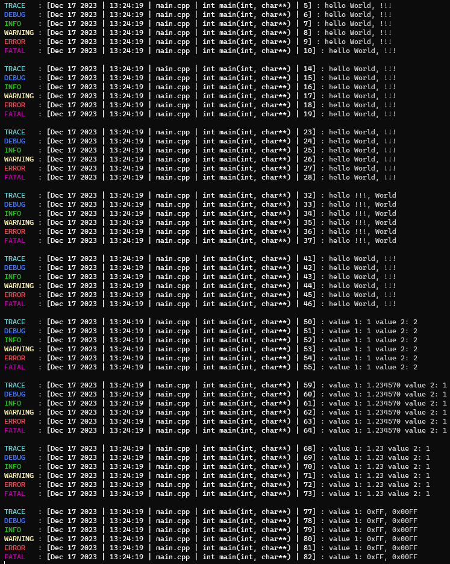

[](https://isocpp.org/std/the-standard )

[](https://sonarcloud.io/summary/new_code?id=RealFaceCode_easyLog)
[](https://sonarcloud.io/summary/new_code?id=RealFaceCode_easyLog)
[](https://sonarcloud.io/summary/new_code?id=RealFaceCode_easyLog)
[](https://sonarcloud.io/summary/new_code?id=RealFaceCode_easyLog)
[](https://sonarcloud.io/summary/new_code?id=RealFaceCode_easyLog)
[](https://sonarcloud.io/summary/new_code?id=RealFaceCode_easyLog)
[](https://sonarcloud.io/summary/new_code?id=RealFaceCode_easyLog)
[](https://sonarcloud.io/summary/new_code?id=RealFaceCode_easyLog)
[](https://sonarcloud.io/summary/new_code?id=RealFaceCode_easyLog)
[](https://sonarcloud.io/summary/new_code?id=RealFaceCode_easyLog)
[](https://sonarcloud.io/summary/new_code?id=RealFaceCode_easyLog)

[](https://sonarcloud.io/summary/new_code?id=RealFaceCode_easyLog)

# EasyLog

This logging system in C++ supports colored output and string replacement. It includes several functions and data structures to facilitate logging with various log levels and customization options.

[New approach on EasyLog](https://github.com/RealFaceCode/eLog.git)

## Features

- Logging messages to the console and/or a file
- Colorizing the output using ASCII color codes
- Buffering log messages for delayed output
- Support for different log states, such as terminal log, file log, etc.
- Configurable options for enabling/disabling logging, colorization, buffering, etc.
- Utility functions for string manipulation and date/time formatting
- Support for log labels to categorize log messages

## Requires

### Development Environment

C++ Compiler: Ensure you have a C++ compiler that supports C++20 or higher for compiling the provided code.

### Libraries and Headers

Standard Libraries: The code utilizes standard C++ libraries such as `<iostream>`, `<string>`, `<vector>`, `<cstdint>`, `<cstring>`, `<source_location>`, `<filesystem>` etc. Ensure these standard libraries are available in your development environment.

### Platform Compatibility

Terminal Support: The colored output is based on ANSI escape sequences and requires a terminal/console that supports ANSI color codes (e.g., UNIX-like systems, Windows Command Prompt with ANSI support enabled).

### Dependencies

No External Dependencies: This logging system does not rely on external third-party libraries or dependencies. It is self-contained using standard C++ libraries.

### Compiler Compatibility

C++20 Support: Ensure your compiler supports C++20 or later standards for proper compilation and functionality of the provided code.

## Usage

To use this logging system:

1. Include the necessary header files.
2. Utilize the provided functions and structures to create logs with different levels of severity, colors, and string replacements.

## Example

Here's a simple example of how to use this logging system:

```cpp
int main()
{
    eLog::logDebug("this is a debug message");
    eLog::logInfo("this is a info message");
    eLog::logWarning("this is a warning message");
    eLog::logError("this is a error message");
    eLog::logFatal("this is a fatal message");

    std::cout << std::endl;

    eLog::logDebug("this is a debug message", 
    {
        eLog::Colorize::colorize("debug", eLog::AsciiColor::ColorEnum::BOLD_RED),
        eLog::Colorize::colorize("message", eLog::AsciiColor::ColorEnum::BOLD_GREEN)
    });
    eLog::logInfo("this is a info message", 
    {
        eLog::Colorize::colorize("info", eLog::AsciiColor::ColorEnum::BOLD_RED),
        eLog::Colorize::colorize("message", eLog::AsciiColor::ColorEnum::BOLD_GREEN)
    });
    eLog::logWarning("this is a warning message", 
    {
        eLog::Colorize::colorize("warning", eLog::AsciiColor::ColorEnum::BOLD_RED),
        eLog::Colorize::colorize("message", eLog::AsciiColor::ColorEnum::BOLD_GREEN)
    });
    eLog::logError("this is a error message", 
    {
        eLog::Colorize::colorize("error", eLog::AsciiColor::ColorEnum::BOLD_RED),
        eLog::Colorize::colorize("message", eLog::AsciiColor::ColorEnum::BOLD_GREEN)
    });
    eLog::logFatal("this is a fatal message", 
    {
        eLog::Colorize::colorize("fatal", eLog::AsciiColor::ColorEnum::BOLD_RED),
        eLog::Colorize::colorize("message", eLog::AsciiColor::ColorEnum::BOLD_GREEN)
    });

    std::cout << std::endl;

    std::string str = "this is a test string for colorizing the string with the help of the eLog::ColorizedString class";

    eLog::logDebug(str, 
    {
        eLog::Colorize::colorize("string", eLog::AsciiColor::ColorEnum::BOLD_GREEN, true),
        eLog::Colorize::colorize("the", eLog::AsciiColor::ColorEnum::MAGENTA, true)
    });
    eLog::logInfo(str, 
    {
        eLog::Colorize::colorize("string", eLog::AsciiColor::ColorEnum::BOLD_CYAN, true),
        eLog::Colorize::colorize("the", eLog::AsciiColor::ColorEnum::RED, true)
    });
    eLog::logWarning(str, 
    {
        eLog::Colorize::colorize("string", eLog::AsciiColor::ColorEnum::BOLD_RED, true),
        eLog::Colorize::colorize("the", eLog::AsciiColor::ColorEnum::WHITE, true)
    });
    eLog::logError(str, 
    {
        eLog::Colorize::colorize("string", eLog::AsciiColor::ColorEnum::BOLD_WHITE, true),
        eLog::Colorize::colorize("the", eLog::AsciiColor::ColorEnum::YELLOW, true)
    });
    eLog::logFatal(str, 
    {
        eLog::Colorize::colorize("string", eLog::AsciiColor::ColorEnum::BOLD_YELLOW, true),
        eLog::Colorize::colorize("the", eLog::AsciiColor::ColorEnum::GREEN, true)
    });

    std::cout << std::endl;

    eLog::logDebug(eLog::fmt::Format("this is a {} message", "debug"));
    eLog::logInfo(eLog::fmt::Format("this is a {:s} message", "info"));
    eLog::logWarning(eLog::fmt::Format("this is a {:s} message {:s}", "warning", "with multiple arguments"));
    eLog::logError(eLog::fmt::Format("this is a {:s} message {:f2}", "error", 3.1415926535));
    eLog::logFatal(eLog::fmt::Format("this is a {:s} message {:x4}", "fatal", 255));

    return 0;
}
```



Example to enable logging to a file

```cpp
int main()
{
    eLog::State::SetState(eLog::State::StateEnum::FILE_LOG, true);
    eLog::State::SetState(eLog::State::StateEnum::TERMINAL_LOG, false);
    eLog::State::SetDefaultFileLogPath("log.txt");

    eLog::logTrace("Hello World!");
    eLog::logDebug("Hello World!");
    eLog::logInfo("Hello World!");
    eLog::logWarning("Hello World!");
    eLog::logError("Hello World!");
    eLog::logFatal("Hello World!");

    return 0;
}
```

Example to defines labels for log messages

```cpp
int main()
{
    eLog::logTrace("Hello World!", "GUI");
    eLog::logDebug("Hello World!", "GFX");
    eLog::logInfo("Hello World!", "GUI");
    eLog::logWarning("Hello World!", "GFX");
    eLog::logError("Hello World!", "GUI");
    eLog::logFatal("Hello World!", "GFX");

    return 0;
}
```



Example to log into internal logbuffers

```cpp
int main()
{
    eLog::State::SetState(eLog::State::StateEnum::FILE_LOG, true);
    eLog::State::SetState(eLog::State::StateEnum::BUFFER_LOG, true);
    eLog::State::SetState(eLog::State::StateEnum::BUFFER_LOG_LABEL, true);
    eLog::State::SetState(eLog::State::StateEnum::BUFFER_FILE_LOG, true);
    eLog::State::SetState(eLog::State::StateEnum::BUFFER_FILE_LOG_LABEL, true);

    eLog::logTrace("Hello World!", "GUI");
    eLog::logDebug("Hello World!", "GFX");
    eLog::logInfo("Hello World!", "GUI");
    eLog::logWarning("Hello World!", "GFX");
    eLog::logError("Hello World!", "GUI");
    eLog::logFatal("Hello World!", "GFX");

    auto b0 = eLog::State::GetLogBuffer();
    auto b1 = eLog::State::GetFileLogBuffer();
    auto b2 = eLog::State::GetLogBufferLabel();
    auto b3 = eLog::State::GetFileLogBufferLabel();
    auto b4 = eLog::State::GetLogBufferByLabel("GUI");
    auto b3 = eLog::State::GetFileLogBufferByLabel("GFX");

    return 0;
}
```

Example of the fmt::Format function

```cpp
int main
{
    eLog::logTrace(eLog::fmt::Format("hello {}, {}", "World", "!!!"));
    eLog::logDebug(eLog::fmt::Format("hello {}, {}", "World", "!!!"));
    eLog::logInfo(eLog::fmt::Format("hello {}, {}", "World", "!!!"));
    eLog::logWarning(eLog::fmt::Format("hello {}, {}", "World", "!!!"));
    eLog::logError(eLog::fmt::Format("hello {}, {}", "World", "!!!"));
    eLog::logFatal(eLog::fmt::Format("hello {}, {}", "World", "!!!"));

    std::cout << std::endl;

    eLog::logTrace(eLog::fmt::Format("hello { }, { }", "World", "!!!"));
    eLog::logDebug(eLog::fmt::Format("hello { }, { }", "World", "!!!"));
    eLog::logInfo(eLog::fmt::Format("hello { }, { }", "World", "!!!"));
    eLog::logWarning(eLog::fmt::Format("hello { }, { }", "World", "!!!"));
    eLog::logError(eLog::fmt::Format("hello { }, { }", "World", "!!!"));
    eLog::logFatal(eLog::fmt::Format("hello { }, { }", "World", "!!!"));

    std::cout << std::endl;

    eLog::logTrace(eLog::fmt::Format("hello {0}, {1}", "World", "!!!"));
    eLog::logDebug(eLog::fmt::Format("hello {0}, {1}", "World", "!!!"));
    eLog::logInfo(eLog::fmt::Format("hello {0}, {1}", "World", "!!!"));
    eLog::logWarning(eLog::fmt::Format("hello {0}, {1}", "World", "!!!"));
    eLog::logError(eLog::fmt::Format("hello {0}, {1}", "World", "!!!"));
    eLog::logFatal(eLog::fmt::Format("hello {0}, {1}", "World", "!!!"));

    std::cout << std::endl;

    eLog::logTrace(eLog::fmt::Format("hello {1}, {0}", "World", "!!!"));
    eLog::logDebug(eLog::fmt::Format("hello {1}, {0}", "World", "!!!"));
    eLog::logInfo(eLog::fmt::Format("hello {1}, {0}", "World", "!!!"));
    eLog::logWarning(eLog::fmt::Format("hello {1}, {0}", "World", "!!!"));
    eLog::logError(eLog::fmt::Format("hello {1}, {0}", "World", "!!!"));
    eLog::logFatal(eLog::fmt::Format("hello {1}, {0}", "World", "!!!"));

    std::cout << std::endl;

    eLog::logTrace(eLog::fmt::Format("hello {:s}, {:s}", "World", "!!!"));
    eLog::logDebug(eLog::fmt::Format("hello {:s}, {:s}", "World", "!!!"));
    eLog::logInfo(eLog::fmt::Format("hello {:s}, {:s}", "World", "!!!"));
    eLog::logWarning(eLog::fmt::Format("hello {:s}, {:s}", "World", "!!!"));
    eLog::logError(eLog::fmt::Format("hello {:s}, {:s}", "World", "!!!"));
    eLog::logFatal(eLog::fmt::Format("hello {:s}, {:s}", "World", "!!!"));

    std::cout << std::endl;

    eLog::logTrace(eLog::fmt::Format("value 1: {:d} value 2: {:d}", 1, 2));
    eLog::logDebug(eLog::fmt::Format("value 1: {:d} value 2: {:d}", 1, 2));
    eLog::logInfo(eLog::fmt::Format("value 1: {:d} value 2: {:d}", 1, 2));
    eLog::logWarning(eLog::fmt::Format("value 1: {:d} value 2: {:d}", 1, 2));
    eLog::logError(eLog::fmt::Format("value 1: {:d} value 2: {:d}", 1, 2));
    eLog::logFatal(eLog::fmt::Format("value 1: {:d} value 2: {:d}", 1, 2));

    std::cout << std::endl;

    eLog::logTrace(eLog::fmt::Format("value 1: {:f} value 2: {:d}", 1.23456789, 1));
    eLog::logDebug(eLog::fmt::Format("value 1: {:f} value 2: {:d}", 1.23456789, 1));
    eLog::logInfo(eLog::fmt::Format("value 1: {:f} value 2: {:d}", 1.23456789, 1));
    eLog::logWarning(eLog::fmt::Format("value 1: {:f} value 2: {:d}", 1.23456789, 1));
    eLog::logError(eLog::fmt::Format("value 1: {:f} value 2: {:d}", 1.23456789, 1));
    eLog::logFatal(eLog::fmt::Format("value 1: {:f} value 2: {:d}", 1.23456789, 1));

    std::cout << std::endl;

    eLog::logTrace(eLog::fmt::Format("value 1: {:f2} value 2: {:d}", 1.23456789, 1));
    eLog::logDebug(eLog::fmt::Format("value 1: {:f2} value 2: {:d}", 1.23456789, 1));
    eLog::logInfo(eLog::fmt::Format("value 1: {:f2} value 2: {:d}", 1.23456789, 1));
    eLog::logWarning(eLog::fmt::Format("value 1: {:f2} value 2: {:d}", 1.23456789, 1));
    eLog::logError(eLog::fmt::Format("value 1: {:f2} value 2: {:d}", 1.23456789, 1));
    eLog::logFatal(eLog::fmt::Format("value 1: {:f2} value 2: {:d}", 1.23456789, 1));

    std::cout << std::endl;

    eLog::logTrace(eLog::fmt::Format("value 1: {:x}, {:x4}", 255, 255));
    eLog::logDebug(eLog::fmt::Format("value 1: {:x}, {:x4}", 255, 255));
    eLog::logInfo(eLog::fmt::Format("value 1: {:x}, {:x4}", 255, 255));
    eLog::logWarning(eLog::fmt::Format("value 1: {:x}, {:x4}", 255, 255));
    eLog::logError(eLog::fmt::Format("value 1: {:x}, {:x4}", 255, 255));
    eLog::logFatal(eLog::fmt::Format("value 1: {:x}, {:x4}", 255, 255));

    return 0;
}
```



## Contributions and Issues

Contributions and bug reports are welcome! Please feel free to open an issue or submit a pull request.

## License

This project is licensed under the [MIT License](LICENSE).
